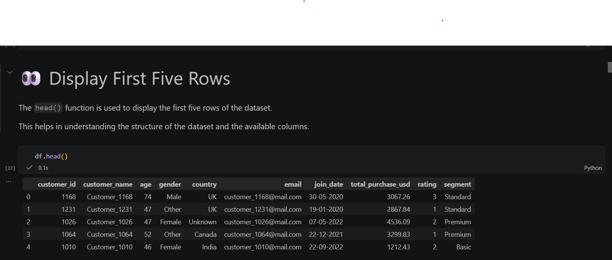
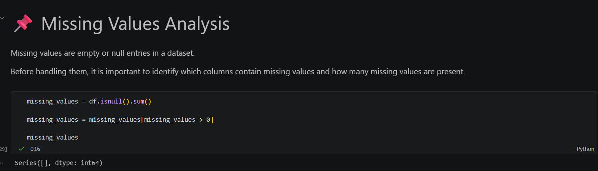
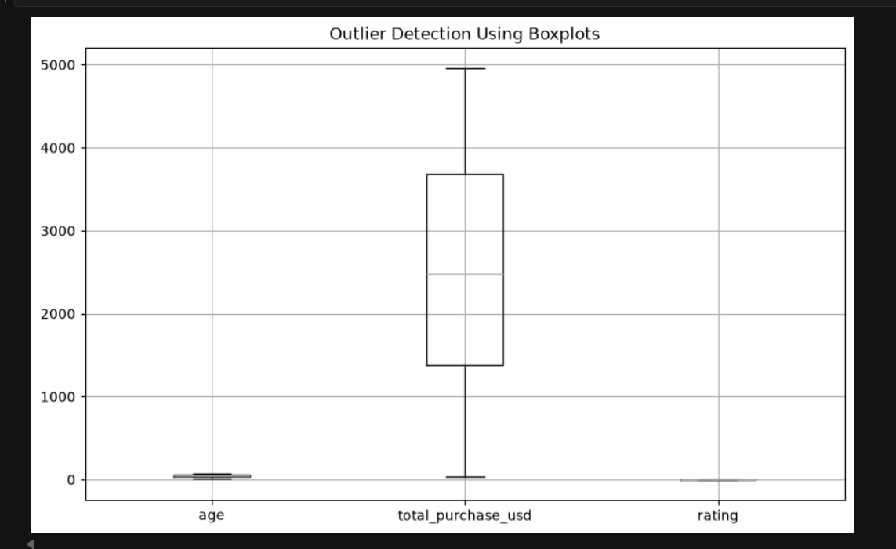

# 📊 Customer Sales Data Cleaning and Preprocessing

> **Data Analyst Internship - Task 1**

A complete data cleaning and preprocessing project using **Python**, **Pandas**, and **Matplotlib**.  
This project demonstrates the essential steps required to transform raw customer sales data into a clean, structured, and analysis-ready dataset.

---

#  Author

**Name:** Nilakshi

**Role:** BCA Student | Aspiring Data Analyst

---

# Project Objective

The objective of this project is to clean and preprocess a raw customer sales dataset by identifying and resolving common data quality issues.

The dataset was analyzed and validated to ensure that it is accurate, consistent, and ready for further data analysis or visualization.

---

#  Tools & Technologies

- Python
- Pandas
- NumPy
- Matplotlib
- Jupyter Notebook
- VS Code
- Git & GitHub

---

#  Project Structure

```
Customer_Sales_Data_Cleaning/
│
├── data/
│   └── customer_sales_raw.csv
│
├── notebooks/
│   └── Data_Cleaning.ipynb
│
├── outputs/
│   └── customer_sales_cleaned.csv
│
├── images/
│
├── README.md
├── requirements.txt
└── .gitignore
```

---

#  Project Workflow

```
Raw Dataset
      │
      ▼
Data Profiling
      │
      ▼
Missing Values Analysis
      │
      ▼
Duplicate Records Analysis
      │
      ▼
Standardize Text Values
      │
      ▼
Date Formatting
      │
      ▼
Rename Column Headers
      │
      ▼
Data Type Validation
      │
      ▼
Outlier Detection
      │
      ▼
Final Data Validation
      │
      ▼
Clean Dataset
```

---

#  Data Cleaning Steps Performed

### Data Exploration

- Loaded the dataset
- Displayed first and last records
- Examined dataset shape
- Reviewed column names
- Checked data types
- Generated statistical summary

---

###  Data Profiling

- Analyzed dataset structure
- Checked unique values
- Reviewed missing values
- Examined duplicate records

---

###  Missing Values Analysis

- Checked missing values using Pandas
- No missing values were found

---

###  Duplicate Records Analysis

- Verified duplicate rows
- No duplicate records were found

---

### Text Standardization

- Removed extra spaces
- Standardized capitalization
- Converted email addresses to lowercase

---

###  Date Formatting

- Converted date columns into datetime format

---

###  Column Validation

- Verified clean and consistent column names

---

###  Data Type Validation

- Confirmed appropriate data types for all columns

---

###  Outlier Detection

- Used boxplots to identify potential outliers

---

###  Final Validation

Verified that:

- No missing values exist
- No duplicate records exist
- Text values are standardized
- Data types are correct
- Dataset is ready for analysis

---

#  Project Results

✔ Dataset successfully cleaned

✔ Data quality validated

✔ Standardized categorical values

✔ Date format verified

✔ Ready for Exploratory Data Analysis (EDA)

✔ Ready for Dashboard Development

✔ Ready for Machine Learning

---

#  Skills Demonstrated

- Data Cleaning
- Data Profiling
- Data Validation
- Data Preprocessing
- Python Programming
- Pandas
- NumPy
- Matplotlib
- Data Quality Assessment
- GitHub Project Management

---

#  Future Improvements

This project can be extended by adding:

- Exploratory Data Analysis (EDA)
- Interactive Power BI Dashboard
- Customer Segmentation
- Sales Prediction Model
- Machine Learning Algorithms
- Automated Data Cleaning Pipeline

---

#  Key Learning Outcomes

Through this project, I learned how to:

- Work with real-world datasets
- Identify data quality issues
- Perform professional data cleaning
- Validate cleaned datasets
- Document projects for GitHub
- Prepare datasets for analytics

---

#  Internship Task

**Task Name:** Data Cleaning and Preprocessing

**Objective:**
Clean and prepare a raw dataset by handling missing values, duplicate records, inconsistent text values, date formatting, data types, and validation using Python (Pandas).

---

# 🙏 Acknowledgement

This project was completed as part of a **Data Analyst Internship** to strengthen practical skills in data preprocessing and build a professional data analytics portfolio.

---

⭐ If you found this project useful, feel free to explore the notebook and review the complete data cleaning workflow.

#  Project Screenshots

## Dataset Preview



## Missing Values Analysis



## Duplicate Rows Analysis


## Outlier Detection



## 📬 Contact

**Author:** Nilakshi

**Project:** Data Cleaning and Preprocessing

**Internship:** Data Analyst Internship